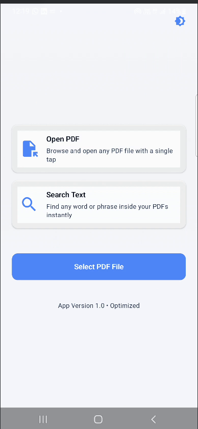
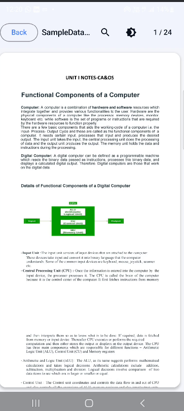
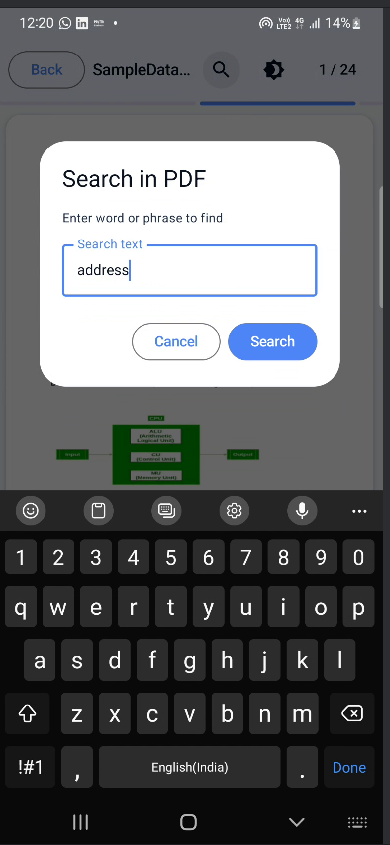
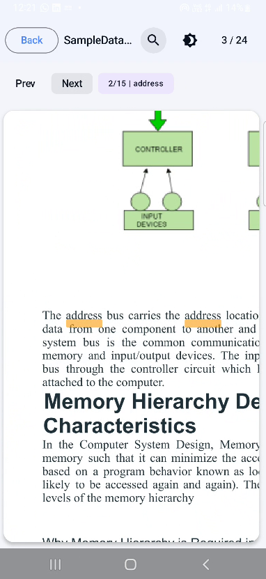
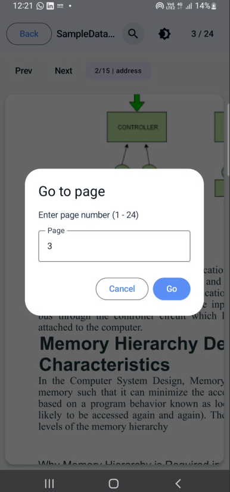

# Viewer

Viewer is a lightweight Android PDF viewer built with Kotlin and AndroidX. It can open PDF files from the file picker, respond to PDF `VIEW` intents, and guide the user to set the app as the default PDF handler.

## Preview



## Features

- Open PDF files from other apps or from a file manager.
- Render the first page of the selected PDF.
- Show clear status messages when no PDF is opened or when loading fails.
- Help users set Viewer as the default app for PDF links and files.

## Screenshots

| Preview | Preview | Preview |
| --- | --- | --- |
|  |  |  |
|  |  |  |

## Requirements

- Android Studio Hedgehog or newer
- Android SDK 36
- Minimum Android version: 23

## Getting Started

1. Clone the repository.
2. Open the project in Android Studio.
3. Let Gradle sync finish.
4. Run the `app` module on an emulator or a physical device.

## Build

To create a debug APK from the project root:

```bash
./gradlew assembleDebug
```

On Windows, use:

```powershell
gradlew.bat assembleDebug
```

## How To Use

1. Open a PDF file with Viewer from your file manager or another app.
2. If the app asks to become the default PDF handler, allow it in system settings.
3. Return to the app and confirm the default app flow if needed.

## Project Notes

- The screenshots used in this README are stored in the `assits/` folder so they stay versioned with the project.
- The app is configured with `VIEW` intent filters for PDF files, so GitHub users can understand the app flow directly from this README and the source code.
